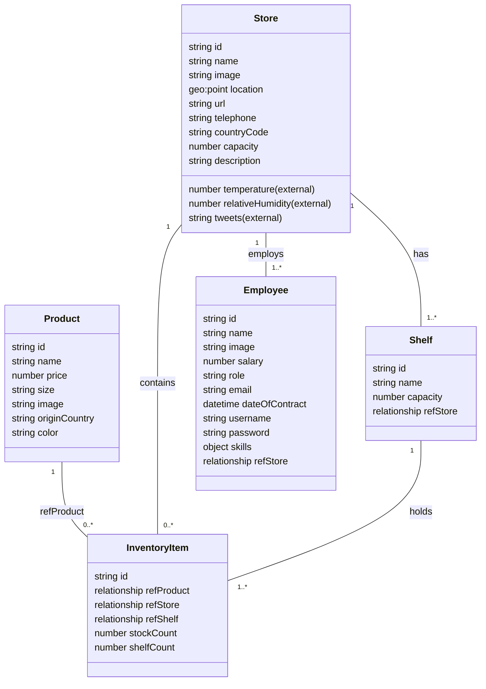

# Data Model: FIWARE Smart Store – Práctica 2

## 1. Visión General del Modelo

**Descripción:** Sistema de 5 entidades principales (Product, Store, Employee, Shelf, InventoryItem) conectadas jerárquicamente para gestionar tiendas inteligentes. El modelo utiliza estándar NGSIv2 compatible con Orion Context Broker, con referencias entre entidades, atributos externos de proveedores y suscripciones basadas en cambios.

**Principios:**
- Modelo relacional mapeado a entidades NGSIv2
- Atributos externos enriquecidos con metadata
- Suscripciones automáticas a cambios críticos
- Validaciones de integridad referencial

---

## 2. Definición de Entidades (Formato NGSIv2)

### 2.1 Product (Producto)

**Propósito:** Catálogo de productos disponibles en tiendas.

**Atributos:**

| Nombre | Tipo | Requerido | Descripción | Validación |
|--------|------|----------|-------------|-----------|
| id | string | SÍ | Identificador único | Ej: PRD-001, debe ser único |
| type | string | SÍ | Tipo de entidad | Siempre: "Product" |
| name | Text | SÍ | Nombre del producto | 3-100 caracteres |
| price | Number | SÍ | Precio en euros | > 0, máx 2 decimales |
| size | Text | SÍ | Tamaño/talla | enum: S, M, L, XL |
| image | URL | SÍ | URL a imagen del producto | URL válida |
| originCountry | Text | SÍ | País de origen | 2 caracteres ISO 3166-1 |
| color | Text | SÍ | Color en formato hex RGB | Formato: #RRGGBB |

**Ejemplo NGSIv2:**

```json
{
  "id": "PRD-001",
  "type": "Product",
  "name": {
    "type": "Text",
    "value": "Laptop Dell XPS 13"
  },
  "price": {
    "type": "Number",
    "value": 899.99
  },
  "size": {
    "type": "Text",
    "value": "M"
  },
  "image": {
    "type": "URL",
    "value": "https://example.com/images/dell-xps-13.jpg"
  },
  "originCountry": {
    "type": "Text",
    "value": "IT"
  },
  "color": {
    "type": "Text",
    "value": "#2C3E50"
  }
}
```

**Relaciones:**
- 1 Product ← referenciado por → N InventoryItems

**Suscripción Asociada:**
- Monitorea cambios en atributo `price`

---

### 2.2 Store (Tienda)

**Propósito:** Ubicaciones físicas de la cadena de tiendas.

**Atributos:**

| Nombre | Tipo | Requerido | Descripción | Validación |
|--------|------|----------|-------------|-----------|
| id | string | SÍ | Identificador único | Ej: STORE-001 |
| type | string | SÍ | Tipo de entidad | Siempre: "Store" |
| name | Text | SÍ | Nombre de la tienda | 3-100 caracteres |
| image | URL | SÍ | Logo/foto frontal | URL válida |
| location | geo:point | SÍ | Coordenadas geográficas | Formato: "lat lon" |
| url | URL | NO | Sitio web de tienda | URL válida |
| telephone | Text | NO | Teléfono de contacto | Formato: +34... |
| countryCode | Text | SÍ | Código país | 2 caracteres ISO 3166-1 |
| capacity | Number | SÍ | Capacidad en m³ | > 0 |
| description | Text | NO | Descripción larga | < 500 caracteres |
| temperature | Number | NO | **EXTERNO** - Temperatura (°C) | Metadata: provider |
| relativeHumidity | Number | NO | **EXTERNO** - Humedad relativa (%) | Metadata: provider |
| tweets | Text | NO | **EXTERNO** - Análisis de tweets | Metadata: provider |

**Ejemplo NGSIv2 (sin atributos externos):**

```json
{
  "id": "STORE-001",
  "type": "Store",
  "name": {
    "type": "Text",
    "value": "Smart Store Madrid Centro"
  },
  "image": {
    "type": "URL",
    "value": "https://example.com/stores/madrid-centro.jpg"
  },
  "location": {
    "type": "geo:point",
    "value": "40.4168 -3.7038"
  },
  "url": {
    "type": "URL",
    "value": "https://stores.example.com/madrid"
  },
  "telephone": {
    "type": "Text",
    "value": "+34-91-555-0001"
  },
  "countryCode": {
    "type": "Text",
    "value": "ES"
  },
  "capacity": {
    "type": "Number",
    "value": 500
  },
  "description": {
    "type": "Text",
    "value": "Tienda inteligente en el corazón de Madrid con tecnología IoT avanzada"
  }
}
```

**Ejemplo con atributos externos:**

```json
{
  "id": "STORE-001",
  "type": "Store",
  "name": {
    "type": "Text",
    "value": "Smart Store Madrid Centro"
  },
  "temperature": {
    "type": "Number",
    "value": 22.5,
    "metadata": {
      "provider": {
        "type": "Text",
        "value": "WeatherAPI"
      },
      "unit": {
        "type": "Text",
        "value": "Celsius"
      },
      "lastUpdate": {
        "type": "DateTime",
        "value": "2026-04-06T14:30:00Z"
      }
    }
  },
  "relativeHumidity": {
    "type": "Number",
    "value": 65.4,
    "metadata": {
      "provider": {
        "type": "Text",
        "value": "WeatherAPI"
      }
    }
  },
  "tweets": {
    "type": "Text",
    "value": "Sentiment: POSITIVE (78%), Mentions: 156, Engagement: 4.2K likes",
    "metadata": {
      "provider": {
        "type": "Text",
        "value": "TwitterAPI"
      }
    }
  }
}
```

**Relaciones:**
- 1 Store → N Employees (empleados asignados)
- 1 Store → N Shelves (estanterías físicas)
- 1 Store → N InventoryItems (inventario distribuido)

---

### 2.3 Employee (Empleado)

**Propósito:** Personas que trabajan en las tiendas.

**Atributos:**

| Nombre | Tipo | Requerido | Descripción | Validación |
|--------|------|----------|-------------|-----------|
| id | string | SÍ | Identificador único | Ej: EMP-001 |
| type | string | SÍ | Tipo de entidad | Siempre: "Employee" |
| name | Text | SÍ | Nombre completo | 3-100 caracteres |
| image | URL | NO | Foto de perfil | URL válida |
| salary | Number | SÍ | Salario mensual (€) | > 0 |
| role | Text | SÍ | Rol/puesto | Ej: Gerente, Vendedor, Almacenero |
| email | Email | SÍ | Correo corporativo | Email válido, único |
| dateOfContract | DateTime | SÍ | Fecha de contratación | Formato: YYYY-MM-DD |
| username | Text | SÍ | Usuario para login | Único, 3-50 caracteres |
| password | Text | SÍ | Contraseña (hasheada) | Hasheada con bcrypt |
| skills | JSON | SÍ | Habilidades (boolean flags) | Ver estructura abajo |
| refStore | Relationship | SÍ | Referencia a Store | ID válido de Store |

**Estructura skills:**

```json
"skills": {
  "type": "Object",
  "value": {
    "MachineryDriving": true,
    "WritingReports": false,
    "CustomerRelationships": true
  }
}
```

**Ejemplo NGSIv2:**

```json
{
  "id": "EMP-001",
  "type": "Employee",
  "name": {
    "type": "Text",
    "value": "Carlos Mendez García"
  },
  "image": {
    "type": "URL",
    "value": "https://example.com/employees/carlos-001.jpg"
  },
  "salary": {
    "type": "Number",
    "value": 2500.00
  },
  "role": {
    "type": "Text",
    "value": "Gerente de Tienda"
  },
  "email": {
    "type": "Email",
    "value": "carlos.mendez@example.com"
  },
  "dateOfContract": {
    "type": "DateTime",
    "value": "2020-03-15T00:00:00Z"
  },
  "username": {
    "type": "Text",
    "value": "cmendez"
  },
  "password": {
    "type": "Text",
    "value": "$2b$12$R9h...(hash bcrypt)"
  },
  "skills": {
    "type": "Object",
    "value": {
      "MachineryDriving": true,
      "WritingReports": true,
      "CustomerRelationships": true
    }
  },
  "refStore": {
    "type": "Relationship",
    "value": "STORE-001"
  }
}
```

**Relaciones:**
- N Employees ← asignados a → 1 Store (relación: refStore)

---

### 2.4 Shelf (Estantería)

**Propósito:** Ubicaciones físicas dentro de una tienda para almacenar productos.

**Atributos:**

| Nombre | Tipo | Requerido | Descripción | Validación |
|--------|------|----------|-------------|-----------|
| id | string | SÍ | Identificador único | Ej: SHELF-001, debe ser único |
| type | string | SÍ | Tipo de entidad | Siempre: "Shelf" |
| name | Text | SÍ | Nombre/ubicación | Ej: "Shelf A1", "Premium Display" |
| capacity | Number | SÍ | Capacidad máxima (items) | > 0, entero |
| refStore | Relationship | SÍ | Referencia a Store | ID válido de Store |

**Ejemplo NGSIv2:**

```json
{
  "id": "SHELF-STORE001-A1",
  "type": "Shelf",
  "name": {
    "type": "Text",
    "value": "Shelf A1 - Electrónica Premium"
  },
  "capacity": {
    "type": "Number",
    "value": 20
  },
  "refStore": {
    "type": "Relationship",
    "value": "STORE-001"
  }
}
```

**Relaciones:**
- 1 Shelf ← pertenece a → 1 Store (refStore)
- 1 Shelf → N InventoryItems

---

### 2.5 InventoryItem (Item de Inventario)

**Propósito:** Instancia de un producto en una tienda/estantería específica con cantidades.

**Atributos:**

| Nombre | Tipo | Requerido | Descripción | Validación |
|--------|------|----------|-------------|-----------|
| id | string | SÍ | Identificador único | Ej: INV-PRD001-STORE1-SHELF1 |
| type | string | SÍ | Tipo de entidad | Siempre: "InventoryItem" |
| refProduct | Relationship | SÍ | Referencia a Product | ID válido de Product |
| refStore | Relationship | SÍ | Referencia a Store | ID válido de Store |
| refShelf | Relationship | SÍ | Referencia a Shelf | ID válido de Shelf |
| stockCount | Number | SÍ | Cantidad en almacén | ≥ 0, entero |
| shelfCount | Number | SÍ | Cantidad en estantería visible | ≥ 0, entero, ≤ stockCount |

**Ejemplo NGSIv2:**

```json
{
  "id": "INV-PRD001-STORE001-SHELF001",
  "type": "InventoryItem",
  "refProduct": {
    "type": "Relationship",
    "value": "PRD-001"
  },
  "refStore": {
    "type": "Relationship",
    "value": "STORE-001"
  },
  "refShelf": {
    "type": "Relationship",
    "value": "SHELF-STORE001-A1"
  },
  "stockCount": {
    "type": "Number",
    "value": 15
  },
  "shelfCount": {
    "type": "Number",
    "value": 5
  }
}
```

**Relaciones:**
- 1 InventoryItem ← referencia → 1 Product
- 1 InventoryItem ← referencia → 1 Store
- 1 InventoryItem ← referencia → 1 Shelf

---

## 3. Relaciones entre Entidades

### 3.1 Matriz de Relaciones

| De | A | Cardinalidad | Tipo | Campo de Referencia |
|----|---|--------------|------|-------------------|
| Product | InventoryItem | 1:N | Composición | refProduct |
| Store | Shelf | 1:N | Composición | refStore (en Shelf) |
| Store | Employee | 1:N | Asociación | refStore (en Employee) |
| Store | InventoryItem | 1:N | Asociación | refStore (en InventoryItem) |
| Shelf | InventoryItem | 1:N | Composición | refShelf (en InventoryItem) |

### 3.2 Descripción Textual de Relaciones

**Relación 1: Product ↔ InventoryItem (1:N)**
- Un producto puede existir en múltiples InventoryItems (diferentes tiendas/estanterías)
- Cada InventoryItem referencia exactamente 1 Product
- Significado: "Este InventoryItem es una instancia de este Product"

**Relación 2: Store ↔ Shelf (1:N)**
- Una tienda contiene múltiples estanterías físicas
- Cada Shelf pertenece a exactamente 1 Store
- Significado: "Esta Shelf forma parte de esta Store"

**Relación 3: Store ↔ Employee (1:N)**
- Una tienda emplea múltiples empleados
- Cada Employee está asignado a exactamente 1 Store
- Significado: "Este Empleado trabaja en esta Store"

**Relación 4: Store ↔ InventoryItem (1:N)**
- Una tienda almacena múltiples InventoryItems
- Cada InventoryItem está en exactamente 1 Store
- Significado: "Este InventoryItem pertenece al inventario de esta Store"

**Relación 5: Shelf ↔ InventoryItem (1:N)**
- Una estantería contiene múltiples InventoryItems
- Cada InventoryItem está asignado a exactamente 1 Shelf
- Significado: "Este InventoryItem está en esta Shelf"

---

## 4. Diagrama UML Mermaid



---

## 5. Formatos NGSIv2 Detallados

### 5.1 Creación de Entidad (POST /v2/entities)

**Ejemplo: Crear un nuevo producto**

```bash
POST http://localhost:1026/v2/entities

Headers:
  Content-Type: application/json

Body:
{
  "id": "PRD-002",
  "type": "Product",
  "name": {
    "type": "Text",
    "value": "iPhone 14 Pro"
  },
  "price": {
    "type": "Number",
    "value": 1099.00
  },
  "size": {
    "type": "Text",
    "value": "M"
  },
  "image": {
    "type": "URL",
    "value": "https://example.com/iphone14pro.jpg"
  },
  "originCountry": {
    "type": "Text",
    "value": "US"
  },
  "color": {
    "type": "Text",
    "value": "#1C1C1C"
  }
}

Response: 201 Created
Location: http://localhost:1026/v2/entities/PRD-002
```

### 5.2 Actualización de Atributo (PATCH /v2/entities/<id>/attrs)

**Ejemplo: Actualizar precio de producto**

```bash
PATCH http://localhost:1026/v2/entities/PRD-002/attrs

Headers:
  Content-Type: application/json

Body:
{
  "price": {
    "value": 999.00
  }
}

Response: 204 No Content
```

**Esto dispara la suscripción "Price Change" → notificación a Backend**

### 5.3 Consulta de Entidad (GET /v2/entities)

**Listar todos los productos**

```bash
GET http://localhost:1026/v2/entities?type=Product

Response: 200 OK
Body: Array de todas las entidades Product
```

**Consulta con filtros**

```bash
GET http://localhost:1026/v2/entities?type=Product&q=price>500;price<1000&attrs=name,price

Response: 200 OK
Body: Array filtrado, solo atributos name y price
```

### 5.4 Consulta de Entidad por ID (GET /v2/entities/<id>)

```bash
GET http://localhost:1026/v2/entities/PRD-001?attrs=name,price,location

Response: 200 OK
Body: 
{
  "id": "PRD-001",
  "type": "Product",
  "name": {...},
  "price": {...}
}
```

### 5.5 Eliminación de Entidad (DELETE /v2/entities/<id>)

```bash
DELETE http://localhost:1026/v2/entities/PRD-002

Response: 204 No Content
```

---

## 6. Suscripciones NGSIv2

### 6.1 Suscripción 1: Cambio de Precio

**Objetivo:** Notificar cuando el precio de cualquier producto cambia.

**Definición:**

```json
{
  "description": "Notificar cuando precio cambia en cualquier producto",
  "subject": {
    "entities": [{"type": "Product"}],
    "condition": {
      "attrs": ["price"]
    }
  },
  "notification": {
    "http": {
      "url": "http://backend:5000/notifications"
    },
    "attrs": ["price", "name"],
    "attrsFormat": "normalized"
  },
  "throttling": 300
}
```

**Creación:**

```bash
POST http://localhost:1026/v2/subscriptions

Headers:
  Content-Type: application/json

Body: [JSON arriba]

Response: 201 Created
Location: http://localhost:1026/v2/subscriptions/{subscription_id}
```

**Evento Generado:** Cuando se ejecuta PATCH /v2/entities/PRD-001/attrs {"price": {"value": 799}}

**Notificación Enviada a Backend:**

```json
POST http://backend:5000/notifications

Body:
{
  "subscriptionId": "63e7d9a1c0a2b3c4d5e6f7g8",
  "data": [
    {
      "id": "PRD-001",
      "type": "Product",
      "name": {
        "type": "Text",
        "value": "Laptop Dell XPS 13"
      },
      "price": {
        "type": "Number",
        "value": 799.00
      }
    }
  ]
}
```

**Procesamiento en Backend:**
```python
@app.route('/notifications', methods=['POST'])
def handle_notification():
    data = request.json
    for entity in data['data']:
        if entity['type'] == 'Product':
            product_id = entity['id']
            old_price = get_cached_price(product_id)
            new_price = entity['price']['value']
            
            # Emitir Socket.IO
            socketio.emit('price_change', {
                'productId': product_id,
                'oldPrice': old_price,
                'newPrice': new_price,
                'timestamp': datetime.now().isoformat()
            }, room='broadcasts')
            
            # Actualizar cache
            cache_price(product_id, new_price)
    
    return {}, 200
```

---

### 6.2 Suscripción 2: Bajo Stock

**Objetivo:** Notificar cuando el stock de un InventoryItem cae bajo 5 unidades.

**Definición:**

```json
{
  "description": "Alertar cuando stockCount cae bajo 5",
  "subject": {
    "entities": [{"type": "InventoryItem"}],
    "condition": {
      "attrs": ["stockCount"],
      "expression": {
        "q": "stockCount<5"
      }
    }
  },
  "notification": {
    "http": {
      "url": "http://backend:5000/notifications"
    },
    "attrs": ["stockCount", "refProduct", "refStore", "refShelf"],
    "attrsFormat": "normalized"
  },
  "throttling": 60
}
```

**Creación:**

```bash
POST http://localhost:1026/v2/subscriptions

Headers:
  Content-Type: application/json

Body: [JSON arriba]

Response: 201 Created
```

**Evento Generado:** Cuando se ejecuta PATCH /v2/entities/INV-001/attrs {"stockCount": {"value": 3}}

**Notificación Enviada a Backend:**

```json
POST http://backend:5000/notifications

Body:
{
  "subscriptionId": "63e7d9a1c0a2b3c4d5e6f7g9",
  "data": [
    {
      "id": "INV-PRD001-STORE001-SHELF001",
      "type": "InventoryItem",
      "stockCount": {
        "type": "Number",
        "value": 3
      },
      "refProduct": {
        "type": "Relationship",
        "value": "PRD-001"
      },
      "refStore": {
        "type": "Relationship",
        "value": "STORE-001"
      },
      "refShelf": {
        "type": "Relationship",
        "value": "SHELF-STORE001-A1"
      }
    }
  ]
}
```

**Procesamiento en Backend:**
```python
@app.route('/notifications', methods=['POST'])
def handle_notification():
    data = request.json
    for entity in data['data']:
        if entity['type'] == 'InventoryItem':
            inv_id = entity['id']
            product_id = entity['refProduct']['value']
            store_id = entity['refStore']['value']
            shelf_id = entity['refShelf']['value']
            stock = entity['stockCount']['value']
            
            # Obtener nombres para UI
            product = OrionService.get_entity(product_id)
            shelf = OrionService.get_entity(shelf_id)
            
            # Emitir Socket.IO
            socketio.emit('low_stock', {
                'storeId': store_id,
                'shelfId': shelf_id,
                'productId': product_id,
                'productName': product['name']['value'],
                'stock_count': stock,
                'timestamp': datetime.now().isoformat()
            }, room='broadcasts')
    
    return {}, 200
```

---

## 7. Registrations (Proveedores Externos)

### 7.1 Registration: Temperatura (Weather API)

**Definición:**

```json
{
  "description": "Proveedor de temperatura para tiendas",
  "dataProvided": {
    "entities": [{"type": "Store", "idPattern": "STORE-.*"}],
    "attrs": ["temperature"]
  },
  "provider": {
    "http": {
      "url": "http://weather-api.example.com/v1/temperature"
    }
  }
}
```

**Creación:**

```bash
POST http://localhost:1026/v2/registrations

Headers:
  Content-Type: application/json

Body: [JSON arriba]

Response: 201 Created
```

**Consultado por Orion cada N minutos:**
```
GET http://weather-api.example.com/v1/temperature?id=STORE-001&attrs=temperature

Expected Response:
{
  "contextResponses": [
    {
      "contextElement": {
        "id": "STORE-001",
        "type": "Store",
        "attributes": [
          {
            "name": "temperature",
            "value": 22.5,
            "type": "Number"
          }
        ]
      }
    }
  ]
}
```

**Orion actualiza Store con este dato:**
```
PATCH /v2/entities/STORE-001/attrs

Body:
{
  "temperature": {
    "type": "Number",
    "value": 22.5,
    "metadata": {
      "provider": {
        "type": "Text",
        "value": "WeatherAPI"
      }
    }
  }
}
```

### 7.2 Registration: Humedad (Weather API)

Similar a temperatura, pero atributo `relativeHumidity`

### 7.3 Registration: Tweets (Twitter API)

**Definición:**

```json
{
  "description": "Proveedor de análisis de tweets para tiendas",
  "dataProvided": {
    "entities": [{"type": "Store"}],
    "attrs": ["tweets"]
  },
  "provider": {
    "http": {
      "url": "http://twitter-api.example.com/v1/sentiment"
    }
  }
}
```

---

## 8. Validaciones y Restricciones

### 8.1 Validaciones de Datos

| Entidad | Campo | Validación | Mensaje de Error |
|---------|-------|-----------|------------------|
| Product | price | > 0 | "Precio debe ser positivo" |
| Product | price | max 2 decimales | "Máximo 2 decimales en precio" |
| Product | size | ∈ {S, M, L, XL} | "Tamaño debe ser S, M, L o XL" |
| Product | color | Regex: #[0-9A-F]{6} | "Color debe ser hex válido (#RRGGBB)" |
| Product | originCountry | Exactamente 2 caracteres | "País debe tener 2 caracteres" |
| Store | countryCode | Exactamente 2 caracteres ISO | "Código país inválido" |
| Store | location | geo:point válido | "Coordenadas fuera de rango" |
| Store | location | lat: [-90, 90], lon: [-180, 180] | "Latitud/Longitud fuera de rango" |
| Employee | salary | > 0 | "Salario debe ser positivo" |
| Employee | email | Email válido | "Email inválido" |
| Employee | dateOfContract | Formato YYYY-MM-DD | "Fecha de contrato inválida" |
| Employee | username | 3-50 caracteres, único | "Username no válido o duplicado" |
| Employee | password | Min 8 caracteres, hasheado | "Password muy débil" |
| Shelf | capacity | > 0 y entero | "Capacidad debe ser entero positivo" |
| InventoryItem | stockCount | ≥ 0 y entero | "Stock no puede ser negativo" |
| InventoryItem | shelfCount | 0 ≤ x ≤ stockCount | "Shelf count no puede exceder stock" |

### 8.2 Validaciones de Integridad Referencial

| Campo | Validación |
|-------|-----------|
| refStore (Employee, Shelf, InventoryItem) | Debe referenciar Store existente |
| refProduct (InventoryItem) | Debe referenciar Product existente |
| refShelf (InventoryItem) | Debe referenciar Shelf existente |
| Unicidad id | Cada id debe ser único por tipo |

---

## 9. Índices MongoDB (Recomendados)

```javascript
// Índices en colección de entidades (db.entities)

db.entities.createIndex({ "id": 1, "type": 1 }, { unique: true });
db.entities.createIndex({ "type": 1 });
db.entities.createIndex({ "attrs.refProduct.value": 1 });
db.entities.createIndex({ "attrs.refStore.value": 1 });
db.entities.createIndex({ "attrs.refShelf.value": 1 });
db.entities.createIndex({ "attrs.price.value": 1 });
db.entities.createIndex({ "attrs.stockCount.value": 1 });
db.entities.createIndex({ "attrs.name.value": "text" }); // Text search
db.entities.createIndex({ "modDate": 1 }, { expireAfterSeconds: 2592000 }); // TTL 30 días
```

---

## 10. Datos Iniciales (Dataset)

### 10.1 Especificación Exacta

```
Stores:       4 (Madrid, Barcelona, Valencia, Bilbao)
Employees:    4 (1-2 por tienda)
Products:    10 (diverso)
Shelves:     16 (4 por tienda)
InventoryItems: ≥64 (≥4 por estantería)
```

### 10.2 Ubicación de Datos Fuente

Directorio: `/home/vvero/XDEI/P2/import-data/`

Archivos JSON:
- `products.json` — Array de 10 productos
- `stores.json` — Array de 4 tiendas
- `employees.json` — Array de 4 empleados
- `shelves.json` — Array de 16 estanterías (4 por tienda)
- `inventory.json` — Array de 64+ InventoryItems

### 10.3 Script de Importación

**Ubicación:** `backend/data/import_data.py`

**Flujo:**
```python
def import_all_data():
    # 1. Leer archivos JSON desde import-data/
    products = load_json("import-data/products.json")
    stores = load_json("import-data/stores.json")
    employees = load_json("import-data/employees.json")
    shelves = load_json("import-data/shelves.json")
    inventory = load_json("import-data/inventory.json")
    
    # 2. Validar estructura de cada dataset
    validate_products(products)
    validate_stores(stores)
    # ... etc
    
    # 3. Crear entidades en Orion (POST /v2/entities)
    for product in products:
        OrionService.create_entity("Product", product)
    
    for store in stores:
        OrionService.create_entity("Store", store)
    
    # ... etc
    
    # 4. Registrar proveedores (POST /v2/registrations)
    register_temperature_provider()
    register_humidity_provider()
    register_tweets_provider()
    
    # 5. Crear suscripciones (POST /v2/subscriptions)
    create_price_change_subscription()
    create_low_stock_subscription()
    
    print("✓ Importación completada")
```

**Ejecución:** En `app.py` durante startup
```python
if __name__ == '__main__':
    initialize_app()  # Llama a import_all_data()
    socketio.run(app, host='0.0.0.0', port=5000)
```

---

## 11. Evolución del Modelo (Para Futuro)

### Posibles Extensiones

1. **Auditoría:** Agregar `createdAt`, `modifiedAt`, `createdBy` a todas las entidades
2. **Versionado:** Historial de cambios de precios/inventario
3. **Categorías:** Nueva entidad `Category` con relación a Products (1:N)
4. **Reseñas:** Nueva entidad `Review` con relación a Products
5. **Transacciones:** Nueva entidad `Transaction` registrando compras
6. **Multi-tenancy:** Soporte para múltiples cadenas de tiendas

---

## 12. Notas de Implementación

1. **Timestamps:** Usa ISO 8601 (YYYY-MM-DDTHH:mm:ssZ) para todos los DateTime
2. **Números:** Usar Number, no String, en Orion
3. **URLs:** Validar formato http:// o https://
4. **Metadata:** La metadata es opcional pero recomendada para auditoría
5. **References:** Usar Relationship type para refs, valor es solo el id (string)
6. **Búsqueda Full-text:** Product.name puede indexarse como text para búsqueda
7. **Contención:** Relaciones 1:N mapeadas a atributos Relationship en el lado N

---

## Referencias Cruzadas

- **PRD.md:** Requisitos que este modelo soporta
- **architecture.md:** Cómo se usa este modelo en la arquitectura
- **specification.md:** Contexto original del proyecto
